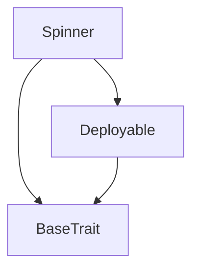
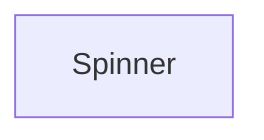

# TACT Compilation Report
Contract: Spinner
BOC Size: 1673 bytes

# Types
Total Types: 8

## StateInit
TLB: `_ code:^cell data:^cell = StateInit`
Signature: `StateInit{code:^cell,data:^cell}`

## Context
TLB: `_ bounced:bool sender:address value:int257 raw:^slice = Context`
Signature: `Context{bounced:bool,sender:address,value:int257,raw:^slice}`

## SendParameters
TLB: `_ bounce:bool to:address value:int257 mode:int257 body:Maybe ^cell code:Maybe ^cell data:Maybe ^cell = SendParameters`
Signature: `SendParameters{bounce:bool,to:address,value:int257,mode:int257,body:Maybe ^cell,code:Maybe ^cell,data:Maybe ^cell}`

## Deploy
TLB: `deploy#946a98b6 queryId:uint64 = Deploy`
Signature: `Deploy{queryId:uint64}`

## DeployOk
TLB: `deploy_ok#aff90f57 queryId:uint64 = DeployOk`
Signature: `DeployOk{queryId:uint64}`

## FactoryDeploy
TLB: `factory_deploy#6d0ff13b queryId:uint64 cashback:address = FactoryDeploy`
Signature: `FactoryDeploy{queryId:uint64,cashback:address}`

## Withdraw
TLB: `withdraw#0ba69751 amount:coins = Withdraw`
Signature: `Withdraw{amount:coins}`

## TransferOwnership
TLB: `transfer_ownership#70373fea newOwner:address = TransferOwnership`
Signature: `TransferOwnership{newOwner:address}`

# Get Methods
Total Get Methods: 3

## balance

## owner

## spinleft
Argument: sender

# Error Codes
2: Stack underflow
3: Stack overflow
4: Integer overflow
5: Integer out of expected range
6: Invalid opcode
7: Type check error
8: Cell overflow
9: Cell underflow
10: Dictionary error
13: Out of gas error
32: Method ID not found
34: Action is invalid or not supported
37: Not enough TON
38: Not enough extra-currencies
128: Null reference exception
129: Invalid serialization prefix
130: Invalid incoming message
131: Constraints error
132: Access denied
133: Contract stopped
134: Invalid argument
135: Code of a contract was not found
136: Invalid address
137: Masterchain support is not enabled for this contract
4633: No spins available
5365: New owner must be different from current owner
12817: Only owner is allowed to withdraw specific amount
15895: Not a depositor
25810: Already withdrawn
28503: Only the current owner can transfer ownership
37352: Only owner is allowed to withdraw safe
41486: Only owner is allowed to withdraw all
54615: Insufficient balance
63463: Minimum deposit is 1 TON

# Trait Inheritance Diagram

# Contract Dependency Diagram

